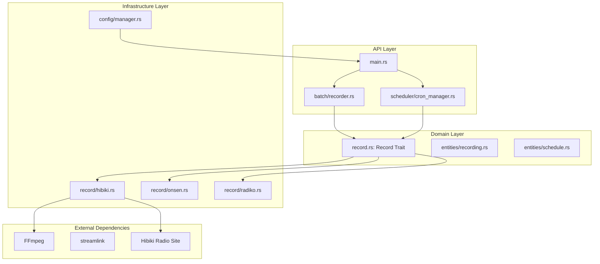
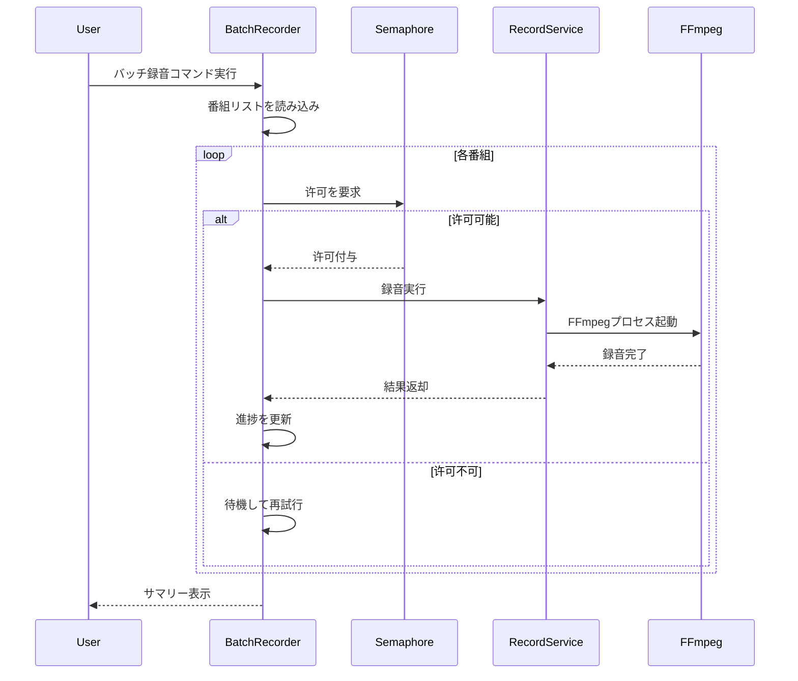
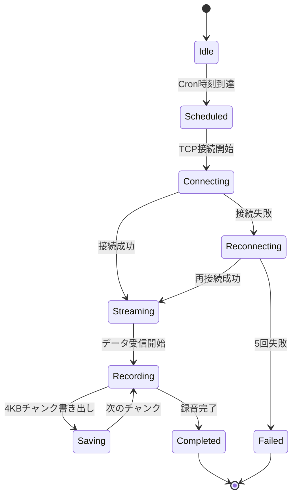
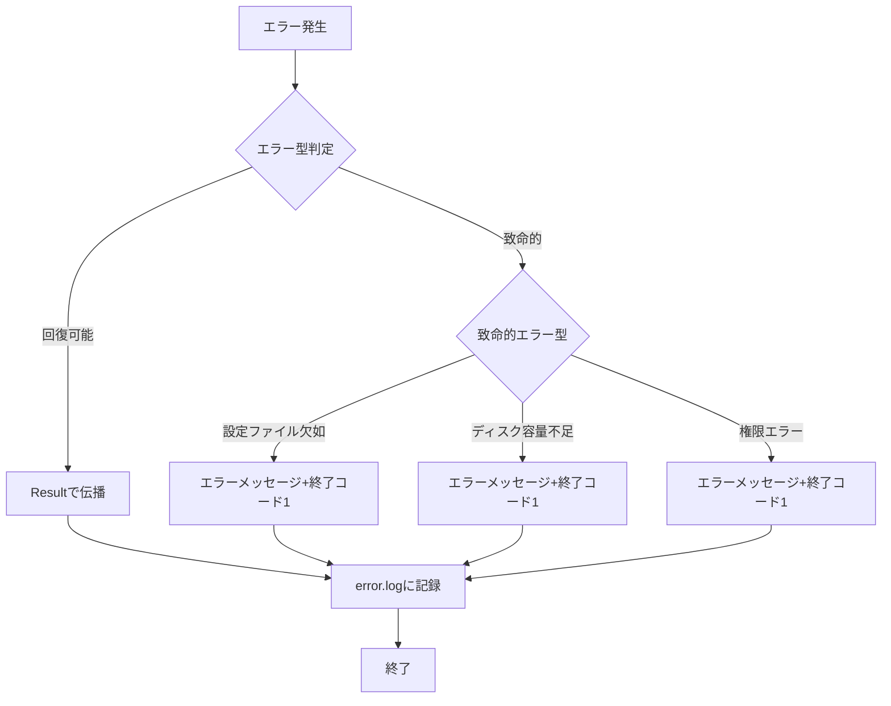
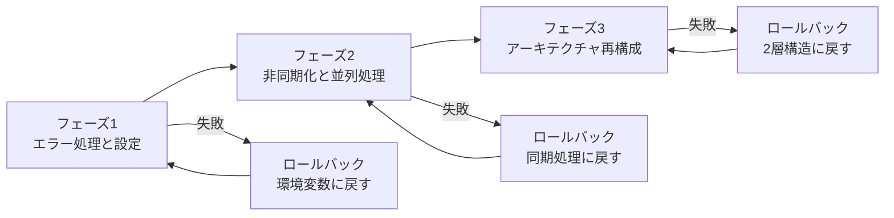

# Technical Design Document: refactor-khrono-balance

## Overview

本リファクタリングプロジェクトは、長期間メンテナンスされていない録音アプリケーションの品質向上と技術的負債の解消を目的とする。Vlad Khononovの『Balancing Coupling in Software Design』に基づく結合度のバランス改善、Rustパッケージのアップデート、適切なエラーハンドリングの実装、非同期/同期処理の最適化、並列処理の改善、およびバッチ/ストリーミング録音機能の整理を行う。

現在のコードベースは `app`（実行層）と `record-lib`（ビジネスロジック層）の2層構造を持ち、Hibiki/Onsen/Radikoの各サービスに対応している。しかし、非同期化が不完全、エラーハンドリングに `.unwrap()` 使用、設定が環境変数に依存、単体テストが不足しているといった課題がある。

**ターゲットユーザー**: 開発者（コードメンテナンス）、運用者（録音タスク管理）

**影響**: 現在の2層構造を domain/infra/api の3層構造に再構成し、エラーハンドリング、非同期処理、テスト容易性を向上させる。

### Goals

- エラーハンドリングの改善：`unwrap()`/`expect()`の排除、`thiserror`/`anyhow`の一貫使用
- 非同期I/O処理の最適化：全I/O処理の非同期化、`tokio`ランタイムの一貫使用
- 並列処理の実装：セマフォによる同時実行制御、`JoinSet`による結果収集
- アーキテクチャの再構成：domain/infra/apiレイヤーの分離、リポジトリパターンの導入
- テスト容易性の向上：ドメイン層の単体テスト、トレイトベースのモック
- 設定管理の改善：`config.toml`の導入、環境変数からの移行
- バックワード互換性：既存設定とデータの移行ツール提供

### Non-Goals

- 新しい録音サービスの追加（既存のHibiki/Onsen/Radikoのみ対象）
- ユーザーインターフェースの変更（CLIのみ、GUIは対象外）
- データベースの導入（ファイルベースのまま）
- コンテナ化やデプロイメントの改善

## Architecture

### Existing Architecture Analysis

**現在のアーキテクチャパターン:**
- 2層構造：`app`（実行層）→ `record-lib`（ビジネスロジック層）
- `Record`トレイトによる各サービスの抽象化
- 環境変数による設定管理
- `tokio-cron-scheduler`によるCronスケジューリング

**既存のドメイン境界:**
- `record-lib/src/record/`: 各サービス実装（Hibiki, Onsen, Radiko）
- `record-lib/src/utils.rs`: 共通ユーティリティとエラー処理
- `app/src/main.rs`: メインアプリケーションとCronスケジューラー

**維持すべき統合ポイント:**
- `Record`トレイトインターフェース
- 外部ツール依存（FFmpeg, streamlink）
- ワークスペース構成（app + record-lib）

**対処すべき技術的負債:**
- HibikiとOnsenの同期処理（blocking I/O）
- `.unwrap()`の使用によるパニックリスク
- 環境変数へのハードコード依存
- 単体テストの不足（ネットワーク実通信依存）

### Architecture Pattern & Boundary Map



**アーキテクチャ統合:**
- **選択パターン**: Layered Architecture with Repository Pattern
- **ドメイン/機能境界**: API層は外部インターフェース、Domain層はビジネスロジック、Infrastructure層は技術実装
- **維持する既存パターン**: `Record`トレイトによるサービス抽象化、ワークスペース構成
- **新規コンポーネントの根拠**:
  - `batch/recorder.rs`: バッチ録音の並列処理と進捗管理
  - `scheduler/cron_manager.rs`: Cron設定の読み込みとタスク管理
  - `config/manager.rs`: 設定ファイルの読み込みと検証
- **ステアリング準拠**: `.kiro/steering/rust-senior.md`のProject Structure Guidelinesに従う

### Technology Stack

| Layer | Choice / Version | Role in Feature | Notes |
|-------|------------------|-----------------|-------|
| Runtime | tokio 1.x | 非同期ランタイム | `multi_thread` scheduler, `spawn_blocking` for CPU-bound tasks |
| HTTP Client | reqwest 0.12 | 非同期HTTPリクエスト | User-Agent/Referer headers for Hibiki |
| Error Handling | thiserror 1.0 + anyhow 1.0 | 型安全なエラー | ライブラリ層は`thiserror`、アプリ層は`anyhow` |
| Logging | tracing + tracing-subscriber | 構造化ロギング | `error.log`への永続化 |
| Config | serde + toml | 設定ファイルパース | `config.toml`と`cron.toml` |
| Async Runtime | tokio-cron-scheduler | Cronスケジューリング | 設定ファイルからスケジュール読み込み |
| Concurrency | tokio::sync::Semaphore | セマフォによる並列制御 | `max_parallel_jobs`設定 |

## System Flows

### バッチ録音フロー



### ストリーミング録音フロー



### エラーハンドリングフロー



## Requirements Traceability

| Requirement | Summary | Components | Interfaces | Flows |
|-------------|---------|------------|------------|-------|
| 1.1-1.5 | バッチ録音機能 | BatchRecorder, Semaphore | Service | バッチ録音フロー |
| 2.1-2.5 | ストリーミング録音機能 | CronManager, RecordService | Service | ストリーミング録音フロー |
| 3.1-3.5 | Hibikiラジオ対応 | HibikiService | API | エラーハンドリングフロー |
| 4.1-4.5 | エラーハンドリング | ErrorHandler, RecordError | State | エラーハンドリングフロー |
| 5.1-5.5 | 並列処理とパフォーマンス | Semaphore, JoinSet | Service | バッチ録音フロー |
| 6.1-6.5 | 非同期I/O処理 | AsyncRuntime, Channel | Service | 全フロー |
| 7.1-7.3 | パフォーマンス改善 | SpawnBlocking, ThreadPool | Service | 全フロー |
| 8.1-8.4 | コード構造のリファクタリング | Domain, Infra, API | - | アーキテクチャ図 |
| 9.1-9.3 | テスト容易性の向上 | MockTraits, TestFixtures | - | - |
| 10.1-10.3 | 堅牢性と保守性 | Tracing, ErrorHandler | State | エラーハンドリングフロー |
| 11.1-11.3 | バックワード互換性 | ConfigMigration, DataMigration | Batch | 移行フロー |

## Components and Interfaces

### サマリーテーブル

| Component | Domain/Layer | Intent | Req Coverage | Key Dependencies (P0/P1) | Contracts |
|-----------|--------------|--------|--------------|--------------------------|-----------|
| BatchRecorder | API | バッチ録音の並列処理と進捗管理 | 1, 5, 6 | Semaphore (P0), RecordService (P0), Config (P0) | Service, Batch |
| CronManager | API | Cron設定の読み込みとタスク管理 | 2, 6, 10 | RecordService (P0), Config (P0) | Service, State |
| RecordTrait | Domain | 録音サービスの抽象化インターフェース | 1-3, 7 | - | Service |
| RecordError | Domain | エラー型の定義と伝播 | 4, 10 | - | State |
| HibikiService | Infra | Hibikiラジオサイトの録音実装 | 3, 6, 7 | FFmpeg (P0), HTTPClient (P0) | Service, API |
| OnsenService | Infra | Onsen Radioの録音実装 | 2, 6, 7 | FFmpeg (P0), HTTPClient (P0) | Service |
| RadikoService | Infra | Radikoの録音実装 | 2, 6, 7 | FFmpeg (P0), HTTPClient (P0) | Service |
| ConfigManager | Infra | 設定ファイルの読み込みと検証 | 1, 2, 5, 11 | - | State |
| ErrorHandler | Domain | エラーのキャッチ、ログ記録、終了処理 | 4, 10 | Tracing (P0) | State |

### API Layer

#### BatchRecorder

| Field | Detail |
|-------|--------|
| Intent | バッチ録音の並列処理、進捗表示、サマリー出力を管理する |
| Requirements | 1, 5, 6 |
| Owner / Reviewers | 開発チーム |

**Responsibilities & Constraints**
- 番組リストの並列ダウンロードを調整
- セマフォによる同時実行数の制御
- 進捗率のリアルタイム表示
- 成功/失敗サマリーの出力
- データ競合を回避するため、各タスクは独立したメモリ空間で動作

**Dependencies**
- Inbound: main.rs — バッチ録音コマンドの実行 (P0)
- Outbound: RecordService — 個別の録音実行 (P0)
- Outbound: ConfigManager — 並列数、リトライ回数、タイムアウトの取得 (P0)
- External: tokio::sync::Semaphore — 同時実行制御 (P0)

**Contracts**: Service [x] / API [ ] / Event [ ] / Batch [x] / State [ ]

##### Service Interface
```rust
pub struct BatchRecorder {
    max_parallel_jobs: usize,
    retry_count: u32,
    timeout: Duration,
}

impl BatchRecorder {
    pub async fn record_batch(
        &self,
        programs: Vec<Program>
    ) -> Result<BatchSummary, BatchError>;

    fn report_progress(&self, completed: usize, total: usize);
}

pub struct BatchSummary {
    pub success_count: usize,
    pub failure_count: usize,
    pub total_duration: Duration,
    pub failures: Vec<(String, String)>, // (program_name, error_message)
}
```
- Preconditions: `programs` は空でない、`max_parallel_jobs` > 0
- Postconditions: 全タスク完了、サマリーが出力される
- Invariants: 進捗率は常に 0-100% の範囲

##### Batch / Job Contract
- Trigger: ユーザーによるバッチ録音コマンド実行
- Input / validation: `Vec<Program>`（各要素はURLと保存先を含む）、空リストはエラー
- Output / destination: 標準出力（進捗）、`error.log`（失敗）、最後にサマリー
- Idempotency & recovery: 失敗したタスクのみ再試行可能、進捗は永続化せず再起動でリセット

**Implementation Notes**
- Integration: `tokio::sync::Semaphore`で同時実行数を制御、`JoinSet`で結果収集
- Validation: 入力リストの検証、設定値の範囲チェック
- Risks: FFmpegプロセスのゾンビ化、メモリリーク（チャンク処理で軽減）

#### CronManager

| Field | Detail |
|-------|--------|
| Intent | `cron.toml`からスケジュールを読み込み、定時録音タスクを管理する |
| Requirements | 2, 6, 10 |
| Owner / Reviewers | 運用チーム |

**Responsibilities & Constraints**
- Cron設定の読み込みと検証
- 時刻に応じた録音タスクのトリガー
- TCP接続の開始とストリーミングデータの受信
- ネットワークエラー時の指数バックオフ再接続
- メタデータのJSON保存

**Dependencies**
- Inbound: main.rs — アプリケーション起動時にスケジュール登録 (P0)
- Outbound: RecordService — 録音実行 (P0)
- Outbound: ConfigManager — Cron設定の読み込み (P0)
- External: tokio-cron-scheduler — スケジューリング (P0)

**Contracts**: Service [x] / API [ ] / Event [ ] / Batch [ ] / State [x]

##### Service Interface
```rust
pub struct CronManager {
    scheduler: JobScheduler,
    recording_service: Arc<dyn RecordService>,
}

impl CronManager {
    pub async fn new(
        config: CronConfig,
        recording_service: Arc<dyn RecordService>
    ) -> Result<Self, CronError>;

    pub async fn start(&self) -> Result<(), CronError>;
}

pub struct CronConfig {
    pub schedules: Vec<Schedule>,
}

pub struct Schedule {
    pub cron_expression: String,
    pub stream_url: String,
    pub output_path: PathBuf,
    pub duration: Duration,
}
```
- Preconditions: `cron_expression` は有効なCron形式
- Postconditions: スケジューラーが実行中、タスクが登録済み
- Invariants: 再接続は最大5回、指数バックオフ（初期1秒、最大60秒）

##### State Management
- State model: `Running` / `Stopped` / `Error`
- Persistence & consistency: 設定ファイルのみ、状態は永続化せず
- Concurrency strategy: `tokio::sync::Mutex`でスケジューラーへのアクセスを保護

**Implementation Notes**
- Integration: `tokio-cron-scheduler`を使用、設定変更時のリロード機能
- Validation: Cron式の構文検証、URLのフォーマット検証
- Risks: タスクの重複実行、メモリ使用量の増加（チャンク処理で512MB以下に維持）

### Domain Layer

#### RecordTrait

| Field | Detail |
|-------|--------|
| Intent | 録音サービスの共通インターフェースを定義する |
| Requirements | 1-3, 7 |
| Owner / Reviewers | アーキテクト |

**Responsibilities & Constraints**
- 録音実行の抽象化
- 各サービス実装の契約定義
- 非同期実行の保証

**Dependencies**
- Inbound: BatchRecorder, CronManager — 録音実行 (P0)
- Outbound: （なし、トレイトは依存を受けない）

**Contracts**: Service [x] / API [ ] / Event [ ] / Batch [ ] / State [ ]

##### Service Interface
```rust
#[async_trait]
pub trait RecordService: Send + Sync {
    async fn record(
        &self,
        url: &str,
        output_path: &Path
    ) -> Result<RecordingMetadata, RecordError>;

    async fn record_batch(
        &self,
        programs: Vec<Program>
    ) -> Result<BatchSummary, RecordError>;
}

pub struct RecordingMetadata {
    pub program_name: String,
    pub start_time: DateTime<Utc>,
    pub end_time: DateTime<Utc>,
    pub file_size: u64,
    pub bitrate: u32,
}
```
- Preconditions: `url` は有効なURL、`output_path` は書き込み可能
- Postconditions: 録音ファイルが保存、メタデータが返却
- Invariants: 録音中はエラー時にリソースをクリーンアップ

#### RecordError

| Field | Detail |
|-------|--------|
| Intent | エラー型の定義とコンテキスト情報の付加 |
| Requirements | 4, 10 |
| Owner / Reviewers | 開発チーム |

**Responsibilities & Constraints**
- 回復可能エラーと致命的エラーの分類
- エラーコンテキストの付加
- `thiserror`による型安全なエラー定義

**Dependencies**
- Inbound: 全コンポーネント — エラー伝播 (P0)
- Outbound: Tracing — ログ記録 (P0)

**Contracts**: Service [ ] / API [ ] / Event [ ] / Batch [ ] / State [x]

##### State Management
- State model: `Recoverable` / `Fatal`
- Persistence & consistency: `error.log`に全エラーを永続化
- Concurrency strategy: スレッド安全、複数スレッドから同時にログ可能

```rust
#[derive(thiserror::Error, Debug)]
pub enum RecordError {
    #[error("Network error: {0}")]
    Network(#[from] reqwest::Error),

    #[error("IO error: {0}")]
    Io(#[from] std::io::Error),

    #[error("FFmpeg command failed: {command}")]
    Ffmpeg { command: String, exit_code: Option<i32> },

    #[error("Configuration error: {0}")]
    Config(String),

    #[error("Unauthorized access to Hibiki site")]
    Unauthorized,

    #[error("HTML parsing failed: site structure may have changed")]
    HtmlParsing,

    #[error("Critical error: {0}")]
    Critical(String),
}
```

### Infrastructure Layer

#### HibikiService

| Field | Detail |
|-------|--------|
| Intent | Hibikiラジオサイトのスクレイピングと録音を実装する |
| Requirements | 3, 6, 7 |
| Owner / Reviewers | 開発チーム |

**Responsibilities & Constraints**
- HTML解析とストリーミングURLの抽出
- User-Agent/Refererヘッダの設定
- 403/429エラーの適切な処理
- FFmpegプロセスの管理

**Dependencies**
- Inbound: RecordTrait — 実装提供 (P0)
- Outbound: FFmpeg — 録音実行 (P0)
- External: reqwest — HTTPリクエスト (P0), Hibikiサイト — ストリーミング配信 (P0)

**Contracts**: Service [x] / API [x] / Event [ ] / Batch [ ] / State [ ]

##### Service Interface
```rust
pub struct HibikiService {
    client: reqwest::Client,
    ffmpeg_path: PathBuf,
}

impl RecordService for HibikiService {
    async fn record(
        &self,
        url: &str,
        output_path: &Path
    ) -> Result<RecordingMetadata, RecordError> {
        // 1. HTML解析でストリーミングURLを抽出
        // 2. FFmpegで録音
        // 3. メタデータを生成
    }
}

impl HibikiService {
    async fn extract_stream_url(&self, page_url: &str)
        -> Result<String, RecordError>;
}
```

##### API Contract
| Method | Endpoint | Request | Response | Errors |
|--------|----------|---------|----------|--------|
| GET | {hibiki_url} | User-Agent, Referer | HTML | 403, 429 |

**Implementation Notes**
- Integration: `reqwest`でHTML取得、`scraper`で解析、FFmpegで録音
- Validation: 403/429ステータスコードの検証、ストリーミングURLのフォーマット検証
- Risks: サイト構造の変更、アクセス拒否（IP制限）

#### OnsenService

| Field | Detail |
|-------|--------|
| Intent | Onsen Radioの録音を実装する |
| Requirements | 2, 6, 7 |
| Owner / Reviewers | 開発チーム |

**Responsibilities & Constraints**
- Onsen RadioサイトのHTML解析
- 非同期I/O処理の実装
- メモリ使用量の制御（4KBチャンク、512MB以下）

**Dependencies**
- Inbound: RecordTrait — 実装提供 (P0)
- Outbound: FFmpeg — 録音実行 (P0)
- External: reqwest — HTTPリクエスト (P0), Onsenサイト — ストリーミング配信 (P0)

**Contracts**: Service [x] / API [ ] / Event [ ] / Batch [ ] / State [ ]

##### Service Interface
```rust
pub struct OnsenService {
    client: reqwest::Client,
    ffmpeg_path: PathBuf,
}

impl RecordService for OnsenService {
    async fn record(
        &self,
        url: &str,
        output_path: &Path
    ) -> Result<RecordingMetadata, RecordError> {
        // 非同期でFFmpegを実行
    }
}
```

**Implementation Notes**
- Integration: 非同期化、`spawn_blocking`でFFmpegを実行
- Validation: チャンクサイズの検証、メモリ使用量の監視
- Risks: 長時間録音時のメモリ増加

#### RadikoService

| Field | Detail |
|-------|--------|
| Intent | Radikoの録音を実装する（認証処理含む） |
| Requirements | 2, 6, 7 |
| Owner / Reviewers | 開発チーム |

**Responsibilities & Constraints**
- Radiko認証処理
- 非同期I/O処理の実装

**Dependencies**
- Inbound: RecordTrait — 実装提供 (P0)
- Outbound: FFmpeg — 録音実行 (P0)
- External: reqwest — HTTPリクエスト (P0), Radiko — ストリーミング配信 (P0)

**Contracts**: Service [x] / API [x] / Event [ ] / Batch [ ] / State [ ]

##### API Contract
| Method | Endpoint | Request | Response | Errors |
|--------|----------|---------|----------|--------|
| POST | /auth1 | AuthKey | 韻符 | 401, 403 |

#### ConfigManager

| Field | Detail |
|-------|--------|
| Intent | 設定ファイルの読み込み、検証、環境変数からの移行 |
| Requirements | 1, 2, 5, 11 |
| Owner / Reviewers | 運用チーム |

**Responsibilities & Constraints**
- `config.toml`と`cron.toml`の読み込み
- 環境変数のフォールバック
- 設定値の検証とデフォルト値の適用
- 互換性のない設定項目の警告

**Dependencies**
- Inbound: 全コンポーネント — 設定提供 (P0)
- Outbound: （なし）

**Contracts**: Service [ ] / API [ ] / Event [ ] / Batch [ ] / State [x]

##### State Management
- State model: 設定は不変、読み取り専用
- Persistence & consistency: 設定ファイルのみ、変更時のリロード機能
- Concurrency strategy: `Arc`で共有、読み取り専用でロック不要

```rust
pub struct Config {
    pub batch: BatchConfig,
    pub streaming: StreamingConfig,
    pub logging: LoggingConfig,
}

pub struct BatchConfig {
    pub max_parallel_jobs: usize,
    pub retry_count: u32,
    pub timeout_seconds: u64,
}

pub struct StreamingConfig {
    pub chunk_size_bytes: usize,
    pub max_memory_mb: usize,
    pub reconnect_initial_delay_secs: u64,
    pub reconnect_max_delay_secs: u64,
    pub max_reconnect_attempts: u32,
}

impl Config {
    pub fn load() -> Result<Self, ConfigError> {
        // 1. config.tomlを読み込み
        // 2. 環境変数をフォールバック
        // 3. デフォルト値を適用
        // 4. 検証
    }
}
```

**Implementation Notes**
- Integration: `serde`と`toml`でパース、`std::env`で環境変数読み込み
- Validation: 範囲チェック（例: `max_parallel_jobs` > 0）、フォーマット検証
- Risks: 設定ファイルの不在、破損、互換性のない項目

## Data Models

### Domain Model

**集約とトランザクション境界:**
- `Recording`: 録音操作の集約ルート（URL、保存先、メタデータ）
- `Schedule`: スケジュール設定の集約ルート（Cron式、ストリームURL、持続時間）

**エンティティと値オブジェクト:**
- `RecordingMetadata`: 値オブジェクト（番組名、開始/終了時刻、ファイルサイズ、ビットレート）
- `Program`: 値オブジェクト（URL、保存先、オプション）
- `BatchSummary`: 値オブジェクト（成功/失敗カウント、合計時間、失敗詳細）

**ドメインイベント:**
- `RecordingStarted`: 録音開始時
- `RecordingCompleted`: 録音完了時
- `RecordingFailed`: 録音失敗時

**ビジネスルールと不変性:**
- 録音中はエラー時にリソースをクリーンアップ
- 進捗率は常に 0-100% の範囲
- 再接続は最大5回

### Logical Data Model

**構造定義:**
- `Recording` 1 -- 0..1 `RecordingMetadata`
- `Schedule` 1 -- 0..* `Recording`
- `BatchSummary` 1 -- 0..* `RecordingFailure`

**整合性と整合性:**
- トランザクション境界: 各録音操作は独立
- カスケードルール: なし（各録音は独立）
- 時刻的側面: メタデータに開始/終了時刻を含む

### Physical Data Model

**ファイルベースのストレージ:**
- 録音ファイル: `$RS_NET_ARCHIVE_PATH/{program_name}_{timestamp}.m4a`
- メタデータ: `$RS_NET_ARCHIVE_PATH/metadata.json`
- 設定ファイル: `config.toml`, `cron.toml`
- エラーログ: `error.log`

**データコントラクトと統合:**

**APIデータ転送:**
- Request: `Program { url: String, output_path: PathBuf }`
- Response: `RecordingMetadata { ... }`
- シリアライズ形式: JSON（メタデータ）、バイナリ（録音ファイル）

**イベントスキーマ:**
- Published events: `RecordingStarted`, `RecordingCompleted`, `RecordingFailed`
- スキーマバージョニング戦略: 構造体のフィールド追加のみ（非破壊的）

## Error Handling

### Error Strategy

**回復可能エラー:**
- ネットワーク一時的エラー: 指数バックオフで再接続
- ファイル書き込み一時的失敗: リトライ
- HTTPステータス 403/429: ユーザーに通知、終了コード2/3

**致命的エラー:**
- 設定ファイルの欠如: エラーメッセージ + 終了コード1
- ディスク容量不足: エラーメッセージ + 終了コード1
- 権限エラー: エラーメッセージ + 終了コード1

### Error Categories and Responses

**ユーザーエラー (4xx相当):**
- 無効な入力 → フィールドレベルの検証
- 設定ファイルの破損 → 具体的なエラー行番号と修正案

**システムエラー (5xx相当):**
- インフラストラクチャ障害 → グレースフルデグラデーション
- タイムアウト → サーキットブレーカー（再接続ロジック）

**ビジネスロジックエラー (422相当):**
- ルール違反 → 条件の説明
- 状態の競合 → 遷移ガイド

### Monitoring

**エラートラッキング:**
- `error.log`に全エラーを永続化
- スタックトレース付きで致命的エラーを記録
- エラーコンテキスト（モジュール名、関数名）を付加

**ヘルスモニタリング:**
- `tracing`クレートによる構造化ログ
- ログレベル: ERROR, WARN, INFO, DEBUG
- `tracing-appender`によるログローテーション

## Testing Strategy

### Unit Tests

**ドメイン層:**
- `RecordTrait`のモック実装によるテスト
- `RecordError`のエラーコンテキスト検証
- 設定値の検証ロジック

**インフラ層:**
- `ConfigManager`の設定パースと検証
- `HibikiService`のHTML解析（モックHTML使用）

### Integration Tests

**クロスコンポーネントフロー:**
- バッチ録音の end-to-end フロー（モックFFmpeg）
- Cronスケジューリングの登録と実行
- エラーハンドリングの伝播とログ記録

### E2E/UI Tests

**クリティカルユーザーパス:**
- バッチ録音コマンドの実行とサマリー確認
- Cron設定による定時録音
- 設定ファイルの読み込みと検証

### Performance/Load

**項目:**
- 並列録音のパフォーマンス（3並列、5並列、10並列）
- 長時間録音時のメモリ使用量（512MB以下を維持）
- 大量バッチ処理（100+プログラム）の進捗表示

## Migration Strategy

### フェーズ1: 最小限の変更（1-2週間）

**実施項目:**
1. エラーハンドリングの改善
   - `unwrap()`/`expect()`の排除
   - `thiserror`/`anyhow`の導入
   - エラーコンテキストの付加

2. 設定ファイルの導入
   - `config.toml`と`cron.toml`の実装
   - 環境変数からの移行
   - デフォルト値の適用

3. 基本的なバッチ録音機能
   - `BatchRecorder`の実装
   - 並列ダウンロードの基本ロジック

**ロールバックトリガー:**
- 既存の録音機能が動作しない
- 設定ファイルの読み込みで頻繁に失敗

**検証チェックポイント:**
- 既存の環境変数設定で動作すること
- エラーログに十分なコンテキストがあること

### フェーズ2: 非同期化と並列処理（2-3週間）

**実施項目:**
1. HibikiとOnsenの非同期化
   - `spawn_blocking`の使用
   - チャンク処理の実装（4KB、512MB制限）

2. セマフォによる並列制御
   - `tokio::sync::Semaphore`の実装
   - `max_parallel_jobs`設定の適用

3. 進捗表示とサマリー
   - リアルタイム進捗率の出力
   - 成功/失敗サマリー

**ロールバックトリガー:**
- メモリ使用量が512MBを超える
- 並列処理でデータ競合が発生

**検証チェックポイント:**
- メモリ使用量が512MB以下であること
- 並列処理でデータ競合がないこと

### フェーズ3: アーキテクチャのリファクタリング（3-4週間）

**実施項目:**
1. レイヤー分離
   - domain/infra/apiのディレクトリ作成
   - `RecordTrait`をdomain層に移動
   - 各サービス実装をinfra層に配置

2. リポジトリパターン
   - `ConfigRepository`トレイトの定義
   - モック実装の提供

3. テストスイートの拡充
   - ドメイン層の単体テスト
   - モックを使用した統合テスト

**ロールバックトリガー:**
- コンパイルエラーが解決できない
- テストカバレッジが大幅に低下

**検証チェックポイント:**
- 全ての単体テストが通ること
- モックが正しく機能すること



## Supporting References

### 外部依存関係の調査

**Hibikiラジオサイト:**
- **Research Needed**: 現在のHTML構造と認証方法
- **調査項目**: User-Agent/Referer要件、403/429の条件
- **場所**: `research.md`に詳細を記録

**FFmpegプロセス管理:**
- **Research Needed**: タイムアウトとリソース管理のベストプラクティス
- **調査項目**: プロセスの適切なクリーンアップ、ゾンビプロセスの防止
- **場所**: `research.md`に詳細を記録

**tokio-cron-scheduler統合:**
- **Research Needed**: `cron.toml`との統合方法
- **調査項目**: 設定ファイルからのスケジュール読み込み、実行時のリロード
- **場所**: `research.md`に詳細を記録
